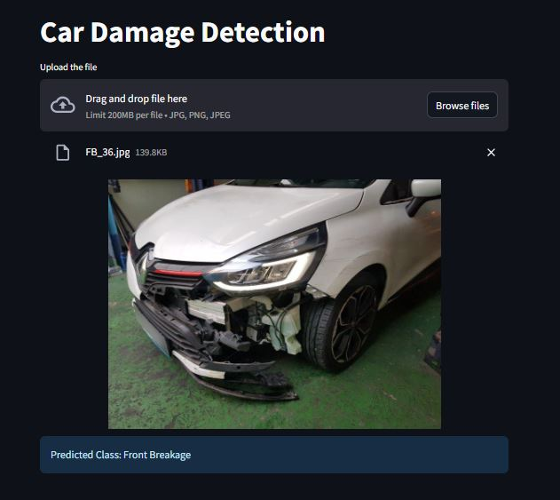

<h2 align="center">Car Damage Detection: The Deep Learning Project</h2>
<p align="center"><b>Automate vehicle damage inspection by harnessing CNNs and transfer‑learning to classify images</b></p>

<p align="center">
  <a href="https://streamlit.io/"></a>
  <a href="https://python-pillow.org/"></a>
  <a href="https://pytorch.org/"></a>
  <a href="https://pytorch.org/vision/stable/"></a>
</p>

---

## Overview

The Car Damage Detection System leverages convolutional neural networks and transfer learning to:

- Automatically identify vehicle damage from front and rear images.
- Classify damage into six categories: Front Normal, Front Breakage, Front Crushed, Rear Normal, Rear Breakage, Rear Crushed.
- Accelerate and standardize the vehicle return inspection process.

---

## Key Features

- **Baseline CNN Module**: Custom CNN architecture achieving a strong starting accuracy.
- **Regularization & Augmentation**: Batch normalization, dropout, and extensive image augmentations for robustness.
- **Transfer Learning**: Leveraging pre-trained EfficientNet B0 and ResNet50 backbones to boost performance on limited data.
- **Hyperparameter Tuning**: Optuna-driven search for optimal learning rate and dropout settings.
- **Model Evaluation**: Detailed classification report and confusion matrix for per-class performance analysis.
- **Interactive Streamlit App**: User-friendly interface to upload or drag-and-drop an image and view predictions instantly.

---
 
## 🚀 Launch App
[https://car-damage-detection-new.streamlit.app/](https://car-damage-detection-new.streamlit.app/)



## 📁 Project Structure

```
app/
│
├── model/
│   ├── saved_model.pth          # Trained DL model for damage classification
│
├── app.py                       # Core Streamlit application
├── model_helper.py              # Using model to classify the image
├── app_screenshot.jpg           # Local demo image for README
├── .gitignore                   # Git ignore rules
├── requirements.txt             # Project dependencies
└── README.md                    # Project overview and instructions
```

---

## Getting Started

### Installation Steps

1. **Clone the Repository**

   ```bash
   git clone https://github.com/AnkitAmbasana/Car-Damage-Detection.git
   cd Car-Damage-Detection
   ```

2. **Install Dependencies**

   ```bash
   pip install -r requirements.txt
   ```

3. **Run the Streamlit App**

   ```bash
   streamlit run app.py
   ```

## Contributing

To Contribute, please submit issues or pull requests for enhancements or fixes.

---

## License

Licensed under the Apache 2.0 License.

---

